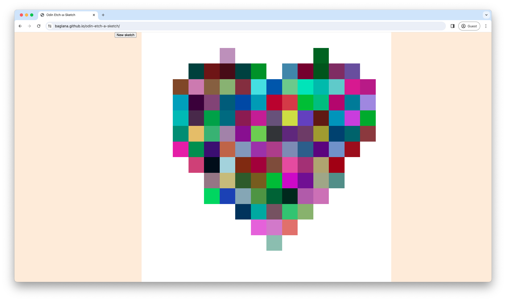
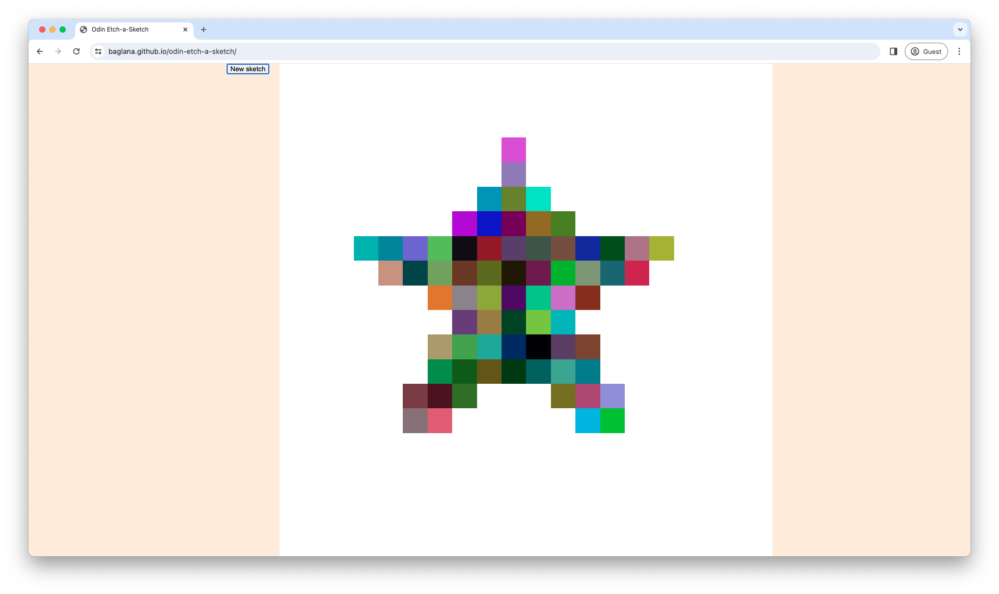

# odin-etch-a-sketch

A project to practice DOM manipulation and events

- Live Demo URL: [https://baglana.github.io/odin-etch-a-sketch/](https://baglana.github.io/odin-etch-a-sketch/)

## Screenshots

## Features:

- Pressing the 'New sketch' button will prompt for a new size of the grid, allowing up to 100 x 100 pixels
- Hovering over an empty square paints it to a random color
- Progressive darkening effect
  - each interaction adds 10% more black or color to the square
  - a square becomes completely black after ten interactions
